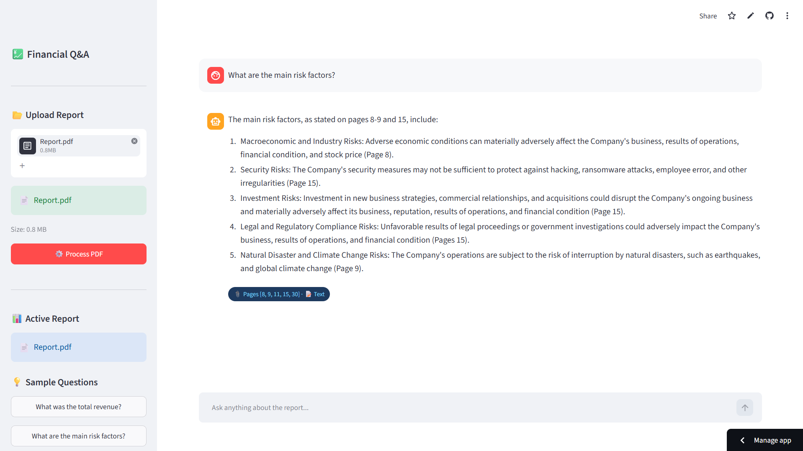

# 💹 Financial Report Q&A

A RAG-based chatbot that lets you chat with financial PDFs — annual reports,
10-K and 10-Q SEC filings — and get accurate answers with page-level citations.


## 🔗 Live Demo
👉 [Try it here](https://financialreportapp-dr9hzevobhz9yyzeyva4xw.streamlit.app/)

## 📄 Sample Report to Test With
Don't have a financial PDF? Use the same one we built this with:

1. Go to 👉 https://www.sec.gov/cgi-bin/browse-edgar?action=getcompany&CIK=AAPL&type=10-K&dateb=&owner=include&count=5
2. Click the most recent 10-K filing
3. Download the PDF version
4. Upload it directly into the app

> This is Apple's official annual report filed with the SEC — free and public.

## 🧠 How It Works

| Step | Component |
|---|---|
| 1️⃣ Upload PDF | PyMuPDF + pdfplumber extract text and tables |
| 2️⃣ Chunking | Text split into 500-word chunks, tables as JSON |
| 3️⃣ Embeddings | sentence-transformers converts chunks to vectors |
| 4️⃣ Storage | ChromaDB stores all vectors locally |
| 5️⃣ Query Router | Numeric questions → table chunks, Narrative → text chunks |
| 6️⃣ LLM Answer | Groq LLaMA 3.3 70B generates answer with page citations |

## ✨ Features

- **Hybrid Query Routing** — detects if your question is numeric or narrative and searches the right chunks
- **Table Extraction** — accurately reads financial tables that most RAG tools miss
- **Page Citations** — every answer includes the exact page numbers from the PDF
- **SEC Filing Support** — optimized for 10-K and 10-Q filings from SEC EDGAR
- **Clean Chat UI** — dark-themed Streamlit interface with sample questions

---

## 📸 Screenshots



---

## 🚀 Run Locally

**1. Clone the repo**
```bash
git clone https://github.com/YOUR_USERNAME/financial-report-qa.git
cd financial-report-qa
```

**2. Create virtual environment**
```bash
python -m venv venv
venv\Scripts\activate   # Windows
source venv/bin/activate  # Mac/Linux
```

**3. Install dependencies**
```bash
pip install -r requirements.txt
```

**4. Add your API key**

Create a `.env` file:
GROQ_API_KEY=your_groq_api_key_here
Get a free Groq API key at https://console.groq.com

**5. Run the app**
```bash
streamlit run app.py
```

---

## 🗂️ Project Structure

| File | Purpose |
|---|---|
| `app.py` | Streamlit UI + main pipeline |
| `query_router.py` | Classifies questions as numeric or narrative |
| `requirements.txt` | All dependencies |
| `.streamlit/config.toml` | Streamlit configuration |
| `.env` | API keys (not uploaded to GitHub) |
| `README.md` | Project documentation |

---

## 💡 Sample Questions to Try

- *"What was the total revenue this year?"*
- *"What are the main risk factors?"*
- *"How did gross margin change year over year?"*
- *"What does management say about future outlook?"*
- *"What were the earnings per share?"*

---

## 🛠️ Tech Stack

| Component | Technology |
|---|---|
| PDF Parsing | PyMuPDF + pdfplumber |
| Embeddings | sentence-transformers (all-MiniLM-L6-v2) |
| Vector DB | ChromaDB |
| LLM | Groq LLaMA 3.3 70B |
| Frontend | Streamlit |
| Language | Python 3.11 |

---

## 🗺️ Roadmap

- [x] PDF text and table extraction
- [x] Hybrid query routing
- [x] Page-level citations
- [x] Streamlit chat UI
- [ ] V2: Multi-report comparison
- [ ] V2: Graphical financial analysis